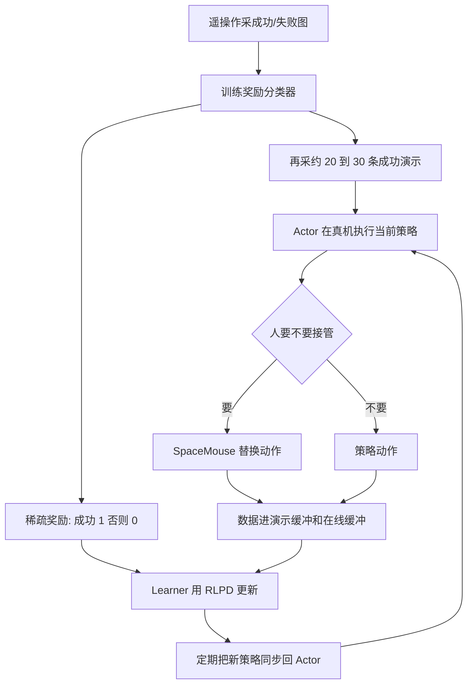

# HIL-SERL USB 插接学习笔记

精简对照两份材料：

- 飞书笔记：[HIL-SERL：精密接触型插接任务](https://j17tak1mfe1.feishu.cn/wiki/UTBhwgi5KigPiXkgkX0cV4X4n5g)
- 官方代码：[rail-berkeley/hil-serl](https://github.com/rail-berkeley/hil-serl)
- 官方论文：Luo et al., arXiv:2410.21845
- 官方项目页：<https://hil-serl.github.io/>

这是学习笔记仓库，不是生产系统，也不是“已经在松灵真机上跑通”的声明。

## 两边看完了吗

| 材料 | 本次实际读到 | 没读到 / 不能当已核实 |
| --- | --- | --- |
| 官方仓库 | README、`serl_robot_infra`、USB 例子的 `config.py` / `wrapper.py` / actor-learner 脚本、`train_rlpd.py` 开头、Franka walkthrough 的 RAM/USB 段 | 没有在真机上跑；没有逐行审计全部 JAX 训练代码 |
| 飞书笔记 | 第 1 节概述：架构、松灵 USB 任务组成、RLPD/SAC 速查 | 第 2 节硬件清单和软件环境正文被截断；安装命令、限位数值、相机串号都没读到 |

结论：方法主链路可以对上。飞书后半的施工细节现在不能当证据。

## 一句话

官方 HIL-SERL 是 Berkeley 的真机视觉强化学习系统。飞书这篇是把它接到松灵机械臂 USB 插拔上的教学 pipeline。算法骨架相同，换的是本体、ROS2 桥和任务范围。

```text
官方：Franka + ROS + Flask + JAX RLPD + SpaceMouse
飞书：松灵 + ROS2 SDK + Flask + 4090 Learner + SpaceMouse
共用：演示 + 人工纠正 + 二分类稀疏奖励 + Actor/Learner
```

## 共用训练链路



官方 walkthrough 的顺序也是：配相机和安全盒 -> 采分类器数据 -> 训分类器 -> 录演示 -> 同时开 actor / learner -> 前期多干预、后期少干预 -> 评测。

## 官方系统精简

HIL-SERL 全称 Human-in-the-Loop Sample-Efficient Robotic Reinforcement Learning（人类在环、样本高效的机器人强化学习）。

论文主张：复杂接触和灵巧操作可以在真机上用视觉 RL 在大约 1 到 2.5 小时训到接近满分，平均成功率大约是模仿学习的 2 倍，执行大约快 1.8 倍。这是官方论文数字，不是本仓库的复现结果。

代码分两层：

| 目录 | 作用 |
| --- | --- |
| `serl_launcher` | 策略、回放缓冲、视觉网络。依赖 JAX 和 agentlace |
| `serl_robot_infra` | Flask 机器人服务 + Franka Gym 环境 |
| `examples` | 采演示、训分类器、RLPD 训练 |
| `examples/experiments/usb_pickup_insertion` | 官方 USB 抓取插入任务 |

USB 例子里，策略看侧视裁剪图加两路腕部相机；奖励分类器只看更小的侧视裁剪。本体感觉包括末端位姿、速度、力、力矩和夹爪。动作走相对末端增量。人用 `SpacemouseIntervention` 随时接管。

训练时要同时跑两个进程：

```bash
bash run_actor.sh
bash run_learner.sh
```

`train_rlpd.py` 里 `--actor` 负责真机交互和传数据，`--learner` 负责从演示缓冲和在线缓冲各抽一半做 SAC/RLPD 更新。

算法只需记三句：

1. PPO 是 on-policy，稳但费样本。
2. SAC 是 off-policy 最大熵 Actor-Critic，能复用旧数据并保持探索。
3. RLPD 在 SAC 上对半混合演示数据和在线数据，所以少量示教就能真机开训。

官方比飞书第 1 节多写了这些设计：ImageNet 预训练 ResNet-10；相对坐标系和开局位姿随机；接触任务用阻抗控制；夹爪开合用单独 DQN，不和连续位移混在一个高斯策略里。

## 飞书笔记精简

飞书第 1 节把同一套方法写成松灵 USB 插拔实战：

- Learner 在本机 RTX 4090，Actor 在机器人端。
- 观测：两路腕部 RealSense + 一路第三视角 + 关节角等本体感觉。
- 动作：末端相对平移增量，任务锁住末端姿态。
- 干预：SpaceMouse 替换危险或无效动作，干预数据回流训练。
- 奖励：第三视角二分类器判断插没插上。
- 工程：机械臂 SDK 进 ROS2，再经 Flask 暴露 `getstate`、`pose`、`jointreset`、夹爪接口。

这和官方 USB 例子高度同构。主要差别是本体从 Franka 换成松灵，ROS 从官方 `franka_ros` 换成厂商 SDK 的 ROS2 封装。

飞书从 `2.2 软件环境` 之后没有读到正文，因此本仓库不转载硬件清单、安装命令或限位数值。

## 对照表

| 点 | 官方 hil-serl | 飞书这篇 |
| --- | --- | --- |
| 角色 | 论文 + 开源代码 | 真机教学 pipeline |
| 机器人 | Franka | 松灵 |
| 任务 | RAM、USB、交接、翻鸡蛋等 | 主要是 USB 插拔 |
| 算法 | RLPD / SAC | 同样写 RLPD / SAC |
| 人在环 | SpaceMouse | 同样 |
| 奖励 | 图像二分类稀疏奖励 | 第三视角二分类 |
| 结构 | Actor / Learner 异步 | 同样；Learner 写 4090 |
| 低层 | 阻抗控制器 + Flask + ROS | SDK -> ROS2 -> Flask |
| 能证明什么 | 公开论文和代码 | 目前只能证明“按官方思路改接松灵 USB” |

## 克隆

```bash
git clone --recurse-submodules https://github.com/Yang1999code/hil-serl-usb-study.git
```

如果已经 clone 过主仓库：

```bash
git submodule update --init --depth 1
```

上游代码在 `third_party/hil-serl`。不要把子模块历史当成我写的代码。

更细的阅读记录：

- [docs/阅读边界.md](docs/阅读边界.md)
- [docs/官方方法精简.md](docs/官方方法精简.md)
- [docs/飞书笔记精简.md](docs/飞书笔记精简.md)

## 不能声称的事

- 不能把官方 Franka 的 1 到 2.5 小时、接近 100% 成功率，写成松灵 USB 已经跑出来的结果。
- 不能把“看懂 pipeline”写成“做过真机”。
- 飞书后半没读到，不能保证那份笔记的安装步骤可复现。
